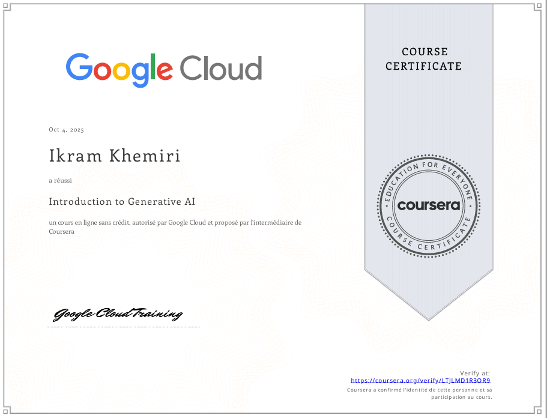
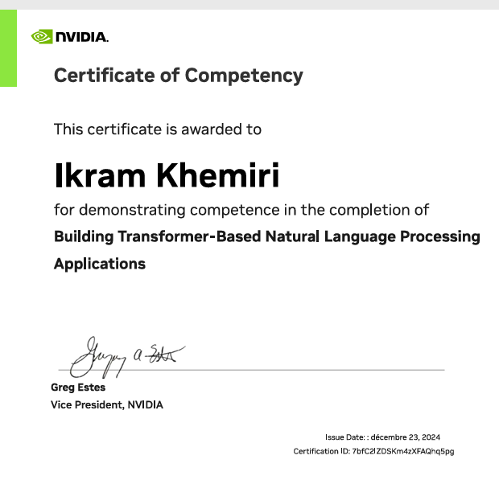
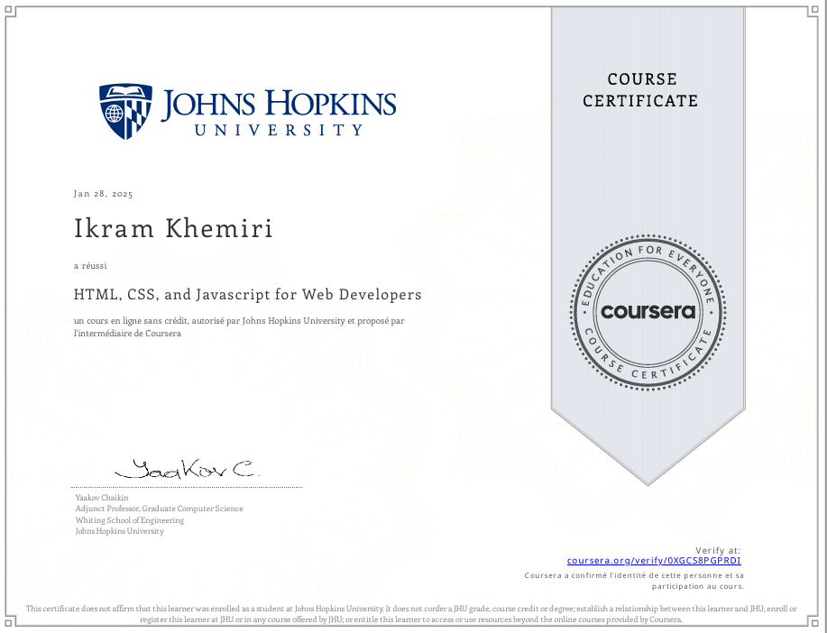
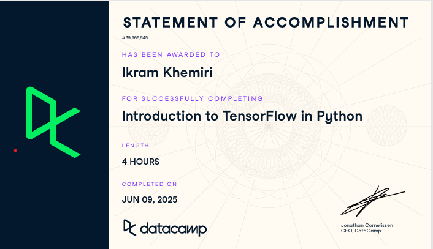

<h1 align="center"> Hi there 👋 , I'm Ikram Khemiri</h1>
<h3 align="center">Final Year AI Engineering Student at ENSI</h3>

---

### About Me

I am a final-year Artificial Intelligence engineering student at ENSI, passionate about intelligent systems, automation, and data-driven applications.  
I enjoy building impactful solutions that combine **AI, software engineering, and automation**.  
Feel free to explore my repositories to discover academic projects, internships, and personal experiments.

---

### 🏆 Certifications

  
  
  
  

<i>More certifications in progress…</i>

---

### 🛠️ Languages & Tools

  <!-- Programming Languages -->
  
  
  
  
  
  
  
  
  
  <!-- Databases -->
  
  
  
  
  
  <!-- AI / ML -->
  
  
  
  
  
  
  <!-- Web & App Development -->
  
  
  
  
  
  <!-- DevOps / Tools -->
  
  
  
  
  
  
  <!-- Networking / Simulation -->
  
  

---

### 📬 Contact

- Email ENSI : [ikram.khemiri@ensi-uma.tn](mailto:ikram.khemiri@ensi-uma.tn)  
- Email Personnel : [ikramkhemiri416@gmail.com](mailto:ikramkhemiri416@gmail.com)  
- LinkedIn : [https://www.linkedin.com/in/ikram-khemiri](https://www.linkedin.com/in/ikram-khemiri)  
- Open to collaboration on **impactful tech projects, AI solutions, and innovative engineering initiatives**

---

### GitHub Stats

  
  

